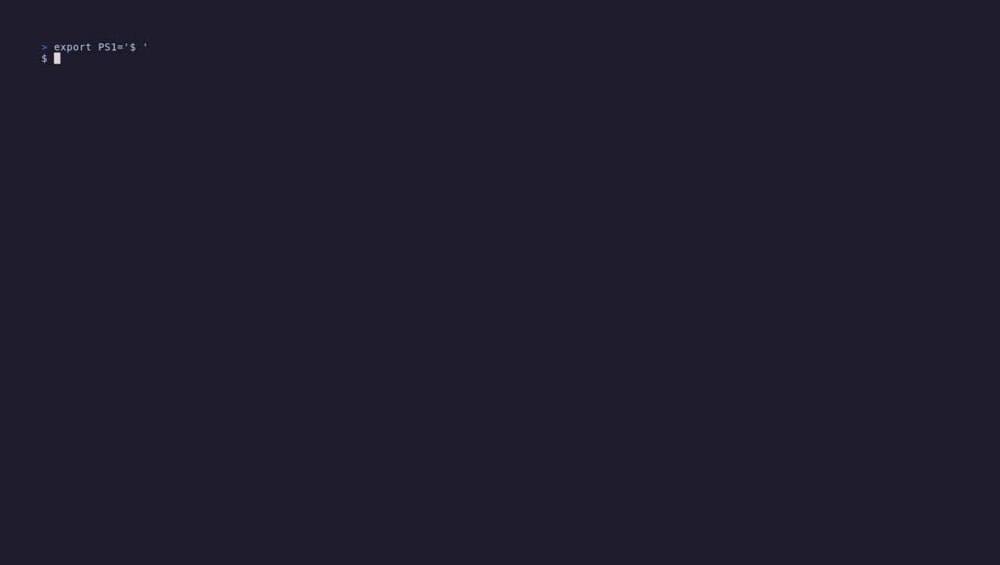

# LayerX Image Inspector

**LayerX Image Inspector** is an open-source terminal tool for inspecting, comparing, and CI-gating **Docker**, **Podman**, and **OCI** container images. Open an image in an interactive TUI, browse the filesystem each layer added, spot wasted bytes, and catch image regressions before they ship — from a single static binary.

[](https://github.com/deveshctl/layerx/actions/workflows/ci.yml)
[](https://github.com/deveshctl/layerx/releases/latest)
[](https://pkg.go.dev/github.com/deveshctl/layerx)
[](https://scorecard.dev/viewer/?uri=github.com/deveshctl/layerx)




> A modern image inspector for the questions `docker history` and `docker inspect` can't answer: *"which layer added this file?"*, *"how many bytes are wasted?"*, *"what actually changed between two builds?"*

---

## Table of contents

- [Why LayerX](#why-layerx)
- [Quick start](#quick-start)
- [Features](#features)
- [Install](#install)
  - [Container image (Docker, Podman, any OCI runtime)](#container-image-docker-podman-any-oci-runtime)
- [Container engines — Docker, Podman, OCI archives](#container-engines)
- [Multi-platform images (`--platform`)](#multi-platform-images---platform)
- [CI mode & GitHub Actions](#ci-mode)
- [Compare two images](#compare-two-images)
- [JSON export](#json-export)
- [Caching](#caching--environment)
- [Verifying releases (Sigstore, SLSA, SBOM)](#verifying-releases)
- [FAQ](#faq)
- [Troubleshooting](#troubleshooting)
- [Contributing](#contributing)
- [Migrating from Dive](docs/migrating-from-dive.md)

---

## Why LayerX

Container images look opaque until something goes wrong: a 2 GB image that should have been 200 MB, a mystery file that reappeared after you thought you deleted it, a base-image bump that quietly doubled the layer count. LayerX Image Inspector opens the image and shows you exactly what's inside — layer by layer, byte by byte.

Use it when you need to:

- **Debug bloated images** and find the exact `RUN` step responsible.
- **Review the filesystem impact** of a Dockerfile change before it ships.
- **Gate CI** on layer waste or efficiency thresholds — with a clear pass/fail signal.
- **Diff two images** (release vs release, base bump vs no-bump) and see every added/removed file.
- **Explore images without a daemon** — pass an OCI or `docker save` archive directly, no Docker required.

LayerX Image Inspector is a **single static binary** with no runtime dependencies beyond your container engine. It works on Linux, macOS, and Windows (native — not just WSL). It reads live images through Docker or Podman, or `docker save` / OCI-layout archives directly from disk.

---

## Quick start

```bash
# macOS / Linux
brew install deveshctl/tap/layerx

# Windows
scoop bucket add layerx https://github.com/deveshctl/scoop-bucket
scoop install layerx

# Explore a live image (auto-detects Docker or Podman)
layerx nginx:latest

# Or explore a saved archive — no daemon required
layerx ./build/app.tar

# Gate a CI build on efficiency
layerx ci --lowest-efficiency 0.95 myapp:${GIT_SHA}
```

Full install matrix (Debian/Ubuntu, RHEL/Fedora, direct download, `go install`, verified releases): see [Install](#install) below.

---

## Features

### Interactive image inspection

- Vim-style navigation (`j/k`, `g/G`, `h/l`), tab-switch between panes, `?` for help.
- Per-layer file tree with diff colouring (green = added, yellow = modified, red = removed).
- **In-place file viewer** (`Enter`) — read file contents inside the TUI, with line numbers, scrolling, and search.
- **File extraction** (`x`) — pull any single file out of any layer, straight to disk.
- Clipboard integration (`y`, `Y`) — copy a path or a file's contents to the system clipboard, over SSH and tmux.
- Sort by size, filter by name, hide unchanged files, jump to the layer that introduced the biggest waste (`w`).
- Split-pane aggregated view — combine multiple layers into one virtual tree.

### Multi-engine, multi-source

- **Docker** via the daemon (auto-negotiates the API version, works on Docker Engine v20 through v29+).
- **Podman** via the Podman socket (`systemctl --user enable --now podman.socket`).
- **OCI-layout archives** and **`docker save` / `podman save` tarballs** read directly from disk — no daemon, no network, no registry.
- **Multi-platform images** — inspect a specific manifest with `--platform linux/amd64`, `linux/arm64`, `linux/arm/v7`, etc.

### CI & automation

- `layerx ci` — three configurable rules (lowest efficiency, highest wasted bytes, highest user-wasted percent). Exit `0` pass, `1` rule failure, `2` operational error.
- `layerx compare OLD NEW` — deterministic side-by-side deltas with a machine-parseable last line (`verdict: ok` / `verdict: regression`).
- `layerx build` — build via docker/podman and inspect the result in a single command.
- `--json` — full analysis (layers, files, efficiency) exported to JSON for scripts, dashboards, and `jq`.
- Starter configs for Node, Python, Java, Go, and generic images (`layerx init --flavour ...`).

### Trust & supply chain

- Every release is [cosign-signed](https://www.sigstore.dev/) (keyless, GitHub OIDC).
- Every archive ships with an **SPDX SBOM** and a **SLSA Build Level 3** provenance attestation.
- Weekly [OpenSSF Scorecard](https://scorecard.dev/viewer/?uri=github.com/deveshctl/layerx) analysis.
- Dependencies pinned to commit SHAs; Renovate keeps them fresh.

---

## Install

### Homebrew (macOS & Linux)

```bash
brew install deveshctl/tap/layerx
```

### Scoop (Windows)

```bash
scoop bucket add layerx https://github.com/deveshctl/scoop-bucket
scoop install layerx
```

### Debian / Ubuntu

```bash
# amd64
curl -LO https://github.com/deveshctl/layerx/releases/latest/download/layerx_linux_amd64.deb
sudo dpkg -i layerx_linux_amd64.deb

# arm64
curl -LO https://github.com/deveshctl/layerx/releases/latest/download/layerx_linux_arm64.deb
sudo dpkg -i layerx_linux_arm64.deb
```

### RHEL / Fedora

```bash
# amd64
curl -LO https://github.com/deveshctl/layerx/releases/latest/download/layerx_linux_amd64.rpm
sudo rpm -i layerx_linux_amd64.rpm

# arm64
curl -LO https://github.com/deveshctl/layerx/releases/latest/download/layerx_linux_arm64.rpm
sudo rpm -i layerx_linux_arm64.rpm
```

### Direct download

Prebuilt binaries for Linux, macOS, and Windows (amd64 + arm64) on the [Releases page](https://github.com/deveshctl/layerx/releases). Replace `latest` with a specific tag (e.g. `v1.5.2`) in any URL above.

### Container image (Docker, Podman, any OCI runtime)

Every tagged release also publishes a multi-arch image (linux/amd64 + linux/arm64) to GitHub Container Registry:

```
ghcr.io/deveshctl/layerx:latest
ghcr.io/deveshctl/layerx:v1.5.2     # pin a specific version
```

LayerX is a client to a running container engine, so the image needs the host engine's socket bind-mounted in. It cannot inspect live images without one — but archive mode (bind-mount a `docker save` / OCI tar) works without any socket at all.

**Docker on Linux** — the socket is owned by `root:docker` on the host. The image runs as `nonroot` (uid 65532) and needs the host's numeric `docker` GID passed in as a supplementary group (the distroless image has no `/etc/group`, so `--group-add docker` by name won't resolve inside the container):

```bash
DOCKER_GID=$(getent group docker | cut -d: -f3 2>/dev/null || awk -F: '/^docker:/{print $3}' /etc/group)
docker run --rm -it \
    --group-add "$DOCKER_GID" \
    -v /var/run/docker.sock:/var/run/docker.sock \
    ghcr.io/deveshctl/layerx:latest nginx:latest
```

(`getent` is glibc-only; the `awk` fallback covers Alpine and musl hosts.)

**Docker Desktop (macOS / Windows)** — the socket is proxied and no group is enforced, so the group flag is not needed:

```bash
docker run --rm -it \
    -v /var/run/docker.sock:/var/run/docker.sock \
    ghcr.io/deveshctl/layerx:latest nginx:latest
```

**Podman (rootless, Linux)** — mount the user's Podman socket at the container's Docker socket path. Podman's Docker-compat API means LayerX talks to it the same way as Docker:

```bash
podman run --rm -it \
    -v "${XDG_RUNTIME_DIR}/podman/podman.sock:/var/run/docker.sock" \
    ghcr.io/deveshctl/layerx:latest alpine:3
```

For rootful Podman on Linux the socket is at `/run/podman/podman.sock`; on macOS / Windows the Podman Machine socket path varies per install — resolve it with `podman info --format '{{.Host.RemoteSocket.Path}}'` and substitute it into the left side of the `-v` flag.

**Archive mode (no daemon)** — bind-mount the tarball read-only, no socket required:

```bash
docker run --rm -it \
    -v "$PWD/alpine.tar:/tmp/alpine.tar:ro" \
    ghcr.io/deveshctl/layerx:latest /tmp/alpine.tar
```

Trade-offs vs. the native binary: the image is a distroless base plus the layerx binary (a few MB of overhead — check the release page for the exact compressed size), it needs the `--group-add` step on Linux for Docker's `root:docker`-owned socket, and file-extraction (`x` key) writes into the container's filesystem — bind-mount an output directory if you want the file on the host. Native binaries are the smoother path for daily use; the container image shines in CI runners that already have an engine but no package manager, and for pinning the exact LayerX version alongside your other build tooling.

> **First release only:** GHCR packages default to private, so `docker pull` returns 401 until visibility is flipped to public — usually within a few hours of a new release landing.

### Build from source

Requires Go 1.26+:

```bash
go install github.com/deveshctl/layerx@latest
```

---

## Usage

```bash
# Interactive TUI — live image (Docker or Podman auto-detected)
layerx nginx:latest

# Interactive TUI — local archive, no daemon required
layerx ./build/app.tar

# Force a fresh analysis (bypass the cache)
layerx --no-cache nginx:latest

# CI mode — exit 1 if efficiency drops below 95%
layerx ci --lowest-efficiency 0.95 myapp:${GIT_SHA}

# JSON export
layerx --json analysis.json nginx:latest

# Shell completion (bash / zsh / fish / PowerShell)
source <(layerx completion bash)
```

`IMAGE_OR_ARCHIVE` is auto-detected: an existing regular file is read directly without contacting any runtime; anything else is resolved through the active container engine. Every subcommand (`ci`, `compare`, `build`, `--json`) accepts both forms.

### TUI keybindings

| Key         | Action                                                       |
|-------------|--------------------------------------------------------------|
| `Tab`       | Switch panel (layers ↔ file tree)                            |
| `j` / `k`   | Move up / down                                               |
| `g` / `G`   | Jump to top / bottom                                         |
| `h` / `l`   | Scroll left / right (file viewer, long lines)                |
| `Enter`     | Open file viewer; expand or collapse a folder                |
| `Esc`       | Dismiss (close search → close viewer → close waste → clear filter → close help). Quits only on the loading and error screens. |
| `/`         | Filter file tree (tree) / search in viewer (viewer)          |
| `n` / `N`   | Next / previous search match (viewer)                        |
| `y`         | Copy file path to clipboard                                  |
| `Y`         | Copy file content (viewer) or layer command (layers)         |
| `d`         | Toggle diff-only mode (hide unchanged files)                 |
| `s`         | Cycle sort: default → largest → smallest                     |
| `S`         | Cycle layer size column: change → stored → stored+change     |
| `w`         | Toggle wasted-files overlay (Enter jumps to introducing layer) |
| `x`         | Extract focused file to disk                                 |
| `A`         | Toggle aggregated (split-pane) view                          |
| `?`         | Toggle help overlay                                          |
| `q`         | Quit                                                         |

---

## Container engines

LayerX talks to any daemon that implements the Docker Engine REST API. Docker and Podman are both first-class. LayerX honours each engine's *native* notion of "which daemon am I currently talking to", so once you've configured your engine the normal way — `docker context use my-remote`, `podman system connection default staging` — `layerx` inspects the same daemon your engine's own CLI would.

### Docker (default)

No setup required. LayerX resolves the endpoint the same way `docker` itself does:

1. `DOCKER_HOST` env if set — for scripted or CI workflows.
2. `DOCKER_CONTEXT` env if set — overrides the active context per-shell.
3. The active Docker context from `~/.docker/config.json` (`docker context use <name>`).
4. The platform default socket:
   - Linux: `/var/run/docker.sock`
   - macOS: `~/.docker/run/docker.sock`
   - Windows: `\\.\pipe\docker_engine`

### Podman

Same idea, with Podman's own env vars and config files:

1. `CONTAINER_HOST` env if set (also `DOCKER_HOST` for back-compat).
2. `CONTAINER_CONNECTION` env if set — overrides the active connection per-shell.
3. The default connection from `~/.config/containers/podman-connections.json` or `containers.conf` (`podman system connection default <name>`).
4. On Linux, the rootless / rootful Podman socket if the systemd unit is running.

The upshot: once you've run `podman system connection add` / `podman system connection default`, `layerx --engine podman <image>` just works. No `DOCKER_HOST=$(podman system connection list …)` shim required.

**Linux quick start** — no connections configured, just the local socket:

```bash
systemctl --user enable --now podman.socket
layerx --engine podman alpine:3
```

If Podman is your only engine, `--engine auto` (the default) falls back to the Podman socket when no Docker socket is found, so the flag is optional.

**macOS / Windows** — Podman Machine ships with a preconfigured connection. Once `podman machine start` is running, `layerx --engine podman alpine:3` picks up the machine's connection automatically. To point at a different remote, use Podman's own tooling:

```bash
podman system connection add prod ssh://user@prod-host/run/user/1000/podman/podman.sock
podman system connection default prod
layerx --engine podman alpine:3        # inspects on prod, no env plumbing
```

### Archive mode (no daemon required)

Skip the engine entirely by passing a `docker save` or `podman save` tar, or an OCI-layout archive:

```bash
podman save -o alpine.tar alpine:3
layerx ./alpine.tar
```

Useful for airgapped machines, CI runners without docker-in-docker, and anyone who prefers not to run a daemon. Archive mode never reads Docker contexts or Podman connections — the file on disk *is* the source of truth.

### Multi-platform images (`--platform`)

Most images on public registries today are multi-platform: `nginx:latest` resolves to a manifest list with separate manifests for `linux/amd64`, `linux/arm64`, and more. By default LayerX inspects whichever variant your engine picks for the host (Apple Silicon → arm64; typical CI runner → amd64). Pass `--platform` to pick one explicitly:

```bash
# Inspect the arm64 variant on an amd64 host (or anywhere)
layerx --platform linux/arm64 nginx:latest

# Variant suffixes are supported (e.g. arm/v7 for older Pis)
layerx --platform linux/arm/v7 alpine:3

# Gate CI against the variant your service actually runs
layerx ci --platform linux/amd64 --lowest-efficiency 0.9 myapp:${GIT_SHA}

# Compare the same image across architectures using two separate inspect runs
layerx --platform linux/amd64 myapp:1.5.0
layerx --platform linux/arm64 myapp:1.5.0
```

Accepted shapes (same as `docker --platform`): `OS/ARCH`, `OS/ARCH/VARIANT`, or the bare arch shortcut (`amd64` is treated as `linux/amd64`). When the requested platform is not in the image's manifest list, LayerX prints the variants the image actually carries — no silent mismatch.

`--platform` works in archive mode too: LayerX sanity-checks the archive against the requested variant and refuses to inspect a mismatched tarball.

---

## CI mode

### GitHub Actions

```yaml
- name: Install LayerX
  run: |
    curl -LO https://github.com/deveshctl/layerx/releases/latest/download/layerx_linux_amd64.deb
    sudo dpkg -i layerx_linux_amd64.deb

- name: Check image efficiency
  run: layerx ci --lowest-efficiency 0.95 myapp:${{ github.sha }}
```

### Configuration

Drop a `.layerx.yaml` in your project root:

```yaml
version: 1

rules:
  lowest-efficiency: 0.9
  highest-wasted-bytes: 52428800    # 50 MB
  highest-user-wasted-percent: 0.1

path-rules:
  block:
    - "**/.git/**"
    - /tmp/**
  deny-waste:
    - "**/*.pyc"
```

CLI flags override config-file values. Setting a threshold to `0` or negative disables that rule.

Full field reference, path-rule semantics, and worked examples: [docs/configuration.md](docs/configuration.md). End-to-end CI/CD recipes (GitHub Actions, GitLab CI, threshold recommendations, exit codes): [docs/ci-integration.md](docs/ci-integration.md).

### Exit codes

| Code | Meaning |
|------|---------|
| `0`  | All rules passed (or, for non-CI commands, the run completed). |
| `1`  | A CI rule failed (`layerx ci`), or `layerx compare` detected a regression. |
| `2`  | Operational error — engine down, archive missing, malformed config, write failure, etc. Don't gate on this; surface it. |

### Starter configs

Run `layerx init` to drop a ready-made `.layerx.yaml`:

```bash
layerx init --flavour node       # Node.js / npm / yarn / pnpm
layerx init --flavour python     # CPython, .pyc and __pycache__ rules
layerx init --flavour java       # Maven, Gradle, multi-stage targets
layerx init --flavour go         # tighter thresholds for Go images
layerx init --flavour generic    # baseline — works for any stack
```

Each starter blocks build-time caches (`/root/.npm/...`, `/root/.cache/pip/...`, etc.) and version-control metadata, and flags wasteful layer patterns. Edit the file after init to tune for your repo. Starters live in [`cmd/examples/`](cmd/examples/).

---

## Compare two images

```bash
# Compare release-to-release
layerx compare myapp:1.4.0 myapp:1.5.0

# Mix archives and refs freely
layerx compare ./build/prev.tar myapp:next

# Show every diff entry instead of the top-N summary
layerx compare --mode full myapp:old myapp:new
```

- Reports size, efficiency, layer, file, and waste deltas in a deterministic text report with aligned columns.
- Default compact mode shows the largest deltas per section with `... and N more` counters; `--mode full` prints everything; `--mode summary` keeps only header + verdict.
- Last line is always machine-parseable: `verdict: ok`, `verdict: regression reason=efficiency,waste`, `verdict: noop digest=<sha256>`, or `verdict: noop reason=path-equal`.
- Exit codes: `0` no regression, `1` regression detected, `2` operational error.
- Live progress on stderr while resolving remote images. Pipe `2>/dev/null` to silence; stdout stays grep-clean for CI gating.

---

## JSON export

Full analysis (layers, files, efficiency) as JSON — pipe through `jq` for scripted checks. Schema, `jq` one-liners, and scripting recipes: [docs/json-export.md](docs/json-export.md).

```bash
layerx --json analysis.json nginx:latest

# Efficiency score
jq '.efficiency.score' analysis.json

# Layers larger than 10 MB
jq '.layers[] | select(.size > 10485760) | {index: .index, command: .command, size: .size}' analysis.json

# Top 5 largest wasted files
jq '.efficiency.wastedFiles | sort_by(-.totalWasted) | .[0:5]' analysis.json
```

Full schema reference and scripting recipes: [docs/json-export.md](docs/json-export.md).

---

## Caching & environment

| Variable                 | Purpose                                                                  |
|--------------------------|--------------------------------------------------------------------------|
| `CI=true`                | Treat `layerx IMAGE` (no subcommand) as `layerx ci IMAGE`                |
| `LAYERX_CACHE_DIR`       | Override the default analysis cache directory                            |
| `LAYERX_CACHE_TTL_DAYS`  | Evict cache entries older than this many days. Default `30`. `0` disables. |
| `LAYERX_CACHE_MAX_BYTES` | Evict oldest entries until total cache size is at or below this. Default `1073741824` (1 GiB). `0` disables. |

Repeat runs against an unchanged image digest reuse the cache and skip the tar export and parse. `--no-cache` bypasses the cache for a single run. The cache self-prunes by age and total size at the end of every successful write.

Inspect and evict cache entries explicitly:

```bash
layerx cache list                    # what's cached
layerx cache prune                   # dry run
layerx cache prune --older-than 7d   # evict entries older than 7 days
layerx cache prune --all             # empty
```

`--older-than` accepts `s`, `m`, `h`, `d`, `w` suffixes (e.g. `90m`, `12h`, `30d`, `2w`).

---

## Verifying releases

Every release ships a cosign-signed `checksums.txt`, an SPDX SBOM per archive, and a SLSA Build Level 3 provenance attestation. Verifying both proves the archive came out of this repository's release workflow on GitHub-hosted runners.

```bash
TAG=v1.5.1   # the release you downloaded
ARCHIVE=layerx_linux_amd64.tar.gz
BASE="https://github.com/deveshctl/layerx/releases/download/${TAG}"

curl -sLO "${BASE}/${ARCHIVE}"
curl -sLO "${BASE}/checksums.txt"
curl -sLO "${BASE}/checksums.txt.sigstore.json"
curl -sLO "${BASE}/multiple.intoto.jsonl"   # SLSA provenance

# 1) Verify the cosign keyless signature over checksums.txt.
cosign verify-blob \
  --bundle checksums.txt.sigstore.json \
  --certificate-identity-regexp "^https://github.com/deveshctl/layerx/" \
  --certificate-oidc-issuer     "https://token.actions.githubusercontent.com" \
  checksums.txt

# 2) Verify the archive matches its checksum.
grep "  ${ARCHIVE}$" checksums.txt | sha256sum --check

# 3) (Optional) Verify SLSA provenance with slsa-verifier.
slsa-verifier verify-artifact "${ARCHIVE}" \
  --provenance-path multiple.intoto.jsonl \
  --source-uri github.com/deveshctl/layerx \
  --source-tag "${TAG}"
```

The signature chain is anchored in [Sigstore](https://www.sigstore.dev/)'s public transparency log; no long-lived keys are involved.

---

## FAQ

### What is LayerX Image Inspector?

LayerX Image Inspector is an open-source command-line tool that opens a container image (Docker, Podman, or OCI archive) in an interactive terminal UI. You can browse each layer, see the files it added or removed, view file contents inline, extract any file to disk, and measure image efficiency (wasted bytes across layers). It also runs headless in CI to fail a build when an image drifts past a size or efficiency threshold.

### Which container engines does LayerX support?

Docker and Podman today, with more engines planned. Any daemon exposing the Docker Engine REST API works out of the box (LayerX negotiates the API version, so it doesn't break on engine upgrades). You can also skip the daemon entirely and point LayerX at a `docker save` or OCI-layout archive on disk.

### Do I need Docker installed to use LayerX?

No. If you have a `docker save` output or an OCI-layout tarball, LayerX reads it directly — no daemon, no network, no root. This makes LayerX useful on airgapped machines, in CI runners that don't allow docker-in-docker, and on developer machines that use Podman or rootless containers instead of Docker.

### How does LayerX relate to `dive`?

LayerX is inspired by [wagoodman/dive](https://github.com/wagoodman/dive) and keeps the same mental model. If you're a Dive user, see [docs/migrating-from-dive.md](docs/migrating-from-dive.md).

### How is LayerX different from `docker history` and `docker inspect`?

`docker history` shows *what commands ran* to build the image; `docker inspect` shows *the image's metadata*. Neither shows *what files each layer actually put into the image*. LayerX opens the layer tarballs, walks the file trees, applies whiteouts, and gives you both: the commands and their concrete filesystem impact.

### Can LayerX gate my CI pipeline on image size?

Yes. `layerx ci IMAGE_OR_ARCHIVE` has three configurable thresholds (lowest efficiency, highest wasted bytes, highest user-wasted percent) and clean exit codes (`0` pass, `1` rule failure, `2` operational error) so you can gate a merge with a single line in GitHub Actions, GitLab CI, or any pipeline runner. See [docs/ci-integration.md](docs/ci-integration.md).

### Does LayerX work on Windows natively?

Yes — Windows binaries for amd64 and arm64 are published with every release, and Scoop is a supported install path. LayerX runs against Docker Desktop, Podman Desktop, or archive files directly. WSL is not required.

### Should I use the container image or the native binary?

Native binaries (Homebrew, Scoop, `.deb`, `.rpm`, direct download) are the smoother path for interactive daily use — they're smaller, launch instantly, and don't need any socket plumbing. The container image at `ghcr.io/deveshctl/layerx` is the right pick when you don't want to install anything on the host: CI runners that already have Docker, one-off inspections from a colleague's machine, or when you want to pin the exact LayerX version alongside your other build tooling. The container image still needs the engine's socket bind-mounted in (or a bind-mounted archive), so it's not usable in a fully-sandboxed environment where the daemon is off-limits.

### Is LayerX safe to run against untrusted images?

LayerX reads image tarballs, walks their file trees, and caps in-memory reads at 2 GiB per file to prevent a crafted tar entry from exhausting memory. It never executes anything from the image. That said, treat any container image as untrusted input: pair LayerX (which tells you *what's inside*) with a vulnerability scanner like Trivy or Grype (which tells you *whether what's inside has known CVEs*).

### Is this project actively maintained?

Yes. Releases are cut on a monthly cadence; every release ships signed artefacts, an SBOM, and SLSA provenance. See the [Releases page](https://github.com/deveshctl/layerx/releases) for the current version and [CHANGELOG.md](CHANGELOG.md) for what's new.

---

## Troubleshooting

- **"Cannot connect to the Docker daemon"** — Docker isn't running. Start Docker Desktop, or `sudo systemctl start docker` on Linux. If your image is already saved as a tarball, pass the file path instead — no daemon required.
- **"Archive not found"** — the path you passed doesn't exist or isn't a regular file. Check spelling; make sure you're not pointing at a directory.
- **"Not a valid image archive"** — the file exists but isn't a `docker save` or OCI-layout tarball. Re-export with `docker save -o image.tar IMAGE` or build with `--output type=oci,dest=image.tar`.
- **"image not found"** — LayerX pulls images on demand. Confirm the reference and that you can `docker pull` (or `podman pull`) it manually.
- **Cache permission errors** — point `LAYERX_CACHE_DIR` at a writable path, e.g. `LAYERX_CACHE_DIR=$HOME/.cache/layerx`.

---

## Contributing

Issues and PRs welcome. For larger changes, open an issue first. See [CONTRIBUTING.md](CONTRIBUTING.md) for the build, test, and branching workflow, and [CHANGELOG](CHANGELOG.md) for release notes.

Security issues: please follow [SECURITY.md](SECURITY.md) — don't open public issues for vulnerabilities.

### Architecture (for contributors)

```
image/    Domain — image reading, tar parsing, file tree, efficiency
tui/      Bubbletea v2 TUI — consumes image/ interfaces only
ci/       CI evaluator — consumes image/ interfaces only
cmd/      Cobra CLI — wires packages together
config/   .layerx.yaml loader
```

Design rules: `image/` has zero imports from `tui/`, `ci/`, or `config/`. TUI and CI consume interfaces, never concrete engine SDK types. All engine client calls negotiate the API version.

### Tech stack

| Concern  | Choice                                                                                         |
|----------|------------------------------------------------------------------------------------------------|
| Language | Go 1.26+                                                                                       |
| CLI      | [cobra](https://github.com/spf13/cobra)                                                        |
| TUI      | [bubbletea v2](https://github.com/charmbracelet/bubbletea) + [lipgloss v2](https://github.com/charmbracelet/lipgloss) + [bubbles v2](https://github.com/charmbracelet/bubbles) |
| Engine   | [moby/moby client](https://github.com/moby/moby) (Docker + Podman via Docker Engine API)       |
| Config   | [goccy/go-yaml](https://github.com/goccy/go-yaml)                                              |
| Testing  | [testify](https://github.com/stretchr/testify)                                                 |

---

## License

MIT — see [LICENSE](LICENSE).
